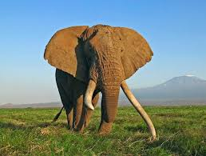

<!DOCTYPE html>
<html lang="de">
<head>
    <meta charset="UTF-8">
    <meta name="viewport" content="width=device-width, initial-scale=1.0">
    <title>Afrikanische Elefanten und Klimawandel</title>
    
</head>
<body>
    <header>
        <h1>Afrikanische Elefanten und der Klimawandel</h1>
        
Wie die Erderwärmung das Leben der größten Landtiere beeinflusst

    </header>

    <nav>
        <a href="#lebensweise">Lebensweise</a>
        <a href="#klimawandel">Klimawandel</a>
        <a href="#hilfe">Was können wir tun?</a>
    </nav>

    <section id="lebensweise" class="intro">
        <h2>Lebensweise der afrikanischen Elefanten</h2>
        
Afrikanische Elefanten (Loxodonta africana) sind die größten Landtiere der Welt. Sie leben in einer Vielzahl von Lebensräumen, darunter Savannen, Wälder und Wüsten, und ernähren sich hauptsächlich von Gräsern, Blättern und Früchten.

        
    </section>

    <section id="klimawandel">
        <h2>Klimawandel und seine Auswirkungen</h2>
        
Der Klimawandel bedroht afrikanische Elefanten vor allem durch:

        <ul>
            <li><strong>Wasserknappheit:</strong> Dürren und ausbleibende Regenzeiten machen Wasserquellen knapp.</li>
            <li><strong>Nahrungsmangel:</strong> Weniger Vegetation reduziert ihre Hauptnahrungsquellen.</li>
            <li><strong>Verlust von Lebensraum:</strong> Die Trocknung von Savannen und Waldverlust schränken ihre Lebensräume ein.</li>
            <li><strong>Konflikte mit Menschen:</strong> Elefanten dringen auf der Suche nach Ressourcen häufiger in bewohnte Gebiete ein.</li>
        </ul>
        
Diese Veränderungen führen zu Stress, höherer Sterblichkeit und geringerer Fortpflanzungsrate, was die Population gefährdet.

    </section>

    <section id="hilfe" class="content">
        <h2>Was können wir tun?</h2>
        
Der Schutz der afrikanischen Elefanten erfordert entschiedene Maßnahmen: Förderung nachhaltiger Landnutzung, Unterstützung von Wasserschutzprojekten und die Reduzierung von Mensch-Tier-Konflikten sind entscheidend.

    </section>

    <footer>
        
&copy; 2024 - Bewusst leben für die Natur

    </footer>
</body>
</html>
